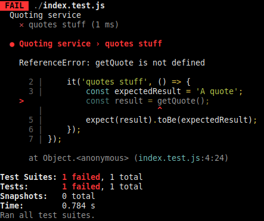

# A Proposal for Postman in Mojaloop

This proposal outlines a vision for a new role for Postman in Mojaloop and Mowali. This document
gives a background on Postman and its use in these projects. It discusses shortcomings with Postman
and its use. It proposes that the Mojaloop project and test suite have outgrown Postman, and that
Postman is a barrier to community contribution. As a solution, it proposes an automatic migration
path from Postman to the open-source Javascript test runner, _Jest_. This retains _all_ of the
excellent work done on the existing test suites, and allows the suite to continue to grow with the
project.

Intended readers are
* users of Postman within Mojaloop and associated projects
* Mojaloop and Postman test authors and QA personnel

It is assumed the reader is familiar with broader Mojaloop terminology. There is a small
[glossary](#glossary) for definitions relevant to this document in particular.

## Table of Contents
- [Background](#background)
    - [Postman](#postman)
    - [Jest](#jest)
- [Motivation](#motivation)
    - [Summary](#summary)
    - [Detail](#detail)
- [A Way Forward](#a-way-forward)
- [Glossary](#glossary)

## Background

### Postman

#### What is Postman?
Postman calls itself _The Collaboration Platform for API Development_. Postman allows users to
generate a suite of API requests, tests and configuration. These can be shared between users of
Postman cloud with ease, or via other mechanisms with a little more difficulty.

#### What is Postman _good_ for?
Postman provides a pleasant UI and a mechanism to encode an API client and share it.

#### What is Postman used for in Mojaloop and Mowali?
Postman is used as
1. A user interface to Mojaloop for developers, testers and operators to exercise FSPIOP and
   Mojaloop admin functionality.
2. A suite of tests for developers and testers to run against Mojaloop interactively.
3. A suite of tests to run in CI environments.

### Jest

#### What is Jest?
Jest is a very popular and well-maintained Javascript test runner, mocking framework and assertion
library. Users write Javascript tests in a style very similar to a range of other runners such as
_Ava_ and _Mocha_. An example:
```javascript
describe('Quoting service', () => {
    it('quotes stuff', () => {
        const expectedResult = 'A quote';
        const result = getQuote();
        expect(result).toBe(expectedResult);
    });
});
```
Users typically run test suites as follows:
```sh
npm run test
```
It is reasonably easy to run a single file or a single test using CLI parameters.  
Output is presented as follows:



Jest supports a range of output formats.

## Motivation
This section details the motivation for this proposal. It will discuss shortcomings of Postman.
None of these shortcomings exist in Jest.

### Summary
- Mojaloop has outgrown Postman
    - Collaboration on Postman tests will become impossible as the number of contributors grows.
        Test developers will need to make changes and race to merge them before that is rendered
        impossible by further development of the collection. This is because of the difficulty of
        merging changes to Postman collections.
    - The quality of tests will decrease as the test suite size increases due to the difficulty of
        code reuse within Postman collections.
    - Test maintenance will become a rapidly increasing burden as the test suite grows due to the
        difficulty of code reuse within Postman collections.
- Quality assurance is fundamentally impossible due to difficulty reviewing Postman collection
    diffs. This is the largest usage of Postman in Mojaloop.
- The test suite will grow increasingly flaky as it increases in size. This is fundamentally
    because of Postman's inability to handle the asynchronous nature of the FSPIOP API. Postman
    requires timeouts and polling to work around this, resulting in unreliable tests. It is not
    practical to use the wider Javascript ecosystem to improve the quality and consistency of the
    tests due to the limitations of the Postman sandbox.

|                                | Jest | Postman |
| ------------------------------ | ---- | ------- |
| Access to Javascript ecosystem | ✓    | ✗       |
| Consistency of execution in CI | ✓    | ✗       |
| Easy code merges               | ✓    | ✗       |
| Easy peer reviews              | ✓    | ✗       |
| Easy sharing of configuration  | ✓    | ✓       |
| Good support for code reuse    | ✓    | ✗       |
| Interactive API exploration    | ✗    | ✓       |
| User interface                 | ✗    | ✓       |

### Detail

#### Peer Review
Because version controlling Postman collections and environments results in very hard-to-read
diffs, it's very difficult to peer review changes to collections and environments.

Some examples:
1. https://github.com/mojaloop/postman/pull/143/files
2. https://github.com/mojaloop/postman/pull/117/files
3. https://github.com/mojaloop/postman/pull/135/files

As a consequence, we resort to a screenshot of passing tests, which is a poor substitute for peer
review. Example:  
https://github.com/mojaloop/postman/pull/143

In the author's opinion, this limitation renders Postman fundamentally inadequate for quality
assurance.

#### Collaboration
Postman collection changes produce very large, unwieldly diffs (see [Peer review](#peer-review) for
examples). This makes maintenance of code changes very difficult. If one makes some changes, but
other changes land in the main branch in the interim, it is exceedingly difficult to merge both
sets of changes. This makes it impossible to maintain a fork for longer-lived differences- a
frequent requirement during development.

#### Code Reuse
Postman makes code reuse very difficult. To share code between tests, one must store and retrieve
these as Postman variables or environment. To use code from outside of Postman, one may set and
retrieve said code (stringified in a JSON file) in Postman environment files, or retrieve this code
using an HTTP request from Postman. In both cases, that code must then be executed in the Postman
environment using `eval` (a security risk in certain contexts).

Additionally, similar tests must be duplicates. If a user wishes to write five tests of similar API
calls, with the same assertions, they must create five nearly-identical duplicates of the test. For
example, one may wish to simply validate responses from five different currency endpoints, e.g.
`/EUR` `/USD` `/RMB` `/GBP` `/CAD`. This would require five duplicated tests. In Jest, we would
call a function with five different arguments, writing the code only once.

Because code reuse is so difficult, users resort to one of the following options:
1. **Copying and pasting to achieve reuse**. This leads to a huge maintenance burden and a rapidly
    increasing error rate in the tests, as test authors must duplicate changes in multiple places
    without error.
2. **Tests that depend on other tests to set the system state**. This makes failures _very_
    difficult to diagnose: when a test fails, one must first identify which _other_ tests are
    required to establish the system state as expected. _"Is my test failing because I didn't run
    the correct tests before it? Which are the correct tests?"_. Postman does not make it easy to
    declare or discover this information: a manual hunt is the strategy of last resort in this
    scenario.
3. **Tests that make assumptions about the system state**. This results in flaky tests.

#### The Wider Development Ecosystem
Postman limits users to the functionality provided in [its sandbox](https://learning.postman.com/docs/writing-scripts/script-references/postman-sandbox-api-reference/).
It is difficult at best to leverage the wider ecosystem of tools and libraries available to a
normal development environment or programming language. Some examples:
- In Mowali it was not feasible to write some tests using Postman, due to reliance on external
    libraries to set Kubernetes system state, access SFTP directories, or parse data formats not
    supported by Postman (XLSX).
- In Mowali it was necessary to use a branch of newman in order to use more than one TLS
    certificate.
- Postman does not support websockets and therefore cannot utilise, for example, [this PR](https://github.com/mojaloop/sdk-scheme-adapter/pull/185).
    This is very useful functionality for an asynchronous API such as FSPIOP-API. Postman has had
    [a PR open for this issue for more than 18 months](https://github.com/postmanlabs/postman-app-support/issues/4009).
- Automatic conversion of Postman tests to Jest used _jscodeshift_, a tool for large-scale
    automated analysis and transformation of Javascript code. This sort of analysis and
    transformation is not accessible to tests written with Postman.
- Postman supports a much more limited range of output formats and integrations than
    the wider Javascript ecosystem.
- Postman development is limited to the Postman IDE. This contains a passable code editor and a
    console for debugging. Jest users have available to them an enormous suite of development and
    debug tools produced by perhaps the most active development community in the world.

#### Javascript Skills
Javascript experience is required to work on Mojaloop effectively. It is an increasingly common
skill set and is highly available in the market. Much more so than Postman skills. Tests written
targeting a commonly-used Javascript runner would be more accessible to prospective users of and
contributors to Mojaloop.

#### Environmental Consistency
Postman has a corresponding runner for executing collections in CI environments, _Newman_. This
mostly works, but there are some differences in the behaviour of the sandbox between Postman and
Newman. These are likely bugs. The consequence is that tests will behave differently in the Postman
UI and when run with Newman. This has been observed to be the source of test failures that have
been very difficult to diagnose.

#### Postman Skills
Postman introduces a sandbox and "scripting" model with
- [a confusing hierarchy of variable scopes](https://learning.postman.com/docs/sending-requests/variables/#variable-scopes)
- [a confusing execution model with explicitly shared data](https://learning.postman.com/docs/writing-scripts/intro-to-scripts/#execution-order-of-scripts)
This requires less common training and experience that requires investment in staff. It is a less
desirable skill than Javascript and therefore staff are likely to buy in less.

## A Way Forward

### Test Suites
This document proposes that all usage of Postman for automated testing should be replaced by Jest.
A tool exists to automatically convert Postman tests to Jest Javascript tests. It has been
successfully used to convert and execute the entire Mowali Postman test suite. It does not produce
perfect code, but it produces code that can be much more easily maintained, refactored and improved
than Postman collections.

### Postman's Role
This document proposes one use for Postman as a UI for the Mojaloop admin API, and the FSPIOP API.
The Mojaloop project should scale back its usage of Postman to provide an example set of requests
against these APIs to enable interactive testing and usage of Mojaloop and FSPIOP functionality.

## Glossary

| Word            | Definition                          |
| --------------- | ----------------------------------- |
| Postman         | See [What is Postman?](#what-is-postman). https://www.postman.com/ |
| Collection      | A suite of tests written in Postman |
| Environment     | A configuration file for Postman    |
| Jest            | A Javascript test runner: https://jestjs.io/ |
| Postman sandbox | A Postman test execution environment |
